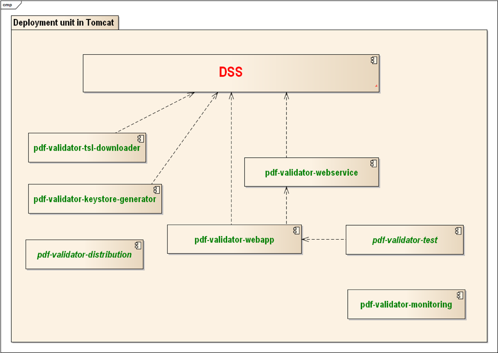

# Architecture of the Core Service

The following picture represents the most important modules (JAR-files) in the single WAR-file of the Service. 
The WAR file can be deployed to an application server like Tomcat.

The Service is built on top of the EU DSS library, which already contains almost everything that the current project needs 
(including a web service for validating signatures). The scope of this project is to add additional requirements (e.g. additional 
validation constraints and monitoring) which are not supported by the existing DSS library. The above diagram shows the main JAR-files 
inside the WAR-file.

The modules in the above image are described in the following list:

- **pdf-validator-webapp** - The main entry point to the system; it exposes the new PDF Validation Service 
  to the outside world. To a large extent, it will be delegating to requests the already existing DSS library code.
- **pdf-validator-webservice** - Web service configuration module.
- **pdf-validator-test** - End-to-end test cases for the service.
- **pdf-validator-monitoring** - Monitoring support module.
- **pdf-validator-tsl-downloader** - The TSL downloader module which makes it possible to use the 
  service with restricted internet access behind firewalls.
- **pdf-validator-keystore-generator** - A utility that helps with configuring the trust anchor (LOTL signing certificates).
- **pdf-validator-distribution** - A Maven module that generates distribution files that include various resources needed by the project. 
