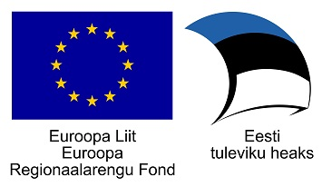

<!--# Introduction-->

    

SiVa is digital signature validation web service that provides SOAP and JSON
API to validate following file types:

 * Older Estonian digital signature files with DDOC extension
 * BDOC containers with `TimeMark` and `TimeStamp` signatures
 * Digitally signed PDF files
 * X-Road security server ASiCE signature containers

Architecture document main purpose is to give overview what SiVa is.
Give an overview of it's internal processes and provide information
when deploying it to production environment.

## SiVa architecture document sections overview

Below list will give You an overview of what each section of the
SiVa architecture document will cover:

* [**Definitions**](siva/definitions) - defines and explines most common concepts used in SiVa documentation
* [**Overview**](siva/overview) - gives overview what SiVa is and
  it's main features.
* [**Structure and activities**](siva/v2/structure_and_activities) - gives overview of
  main SiVa subsystems and and and base validation Java libraries
  used for different validation services
* [**Interfaces**](siva/v2/interfaces) - Description of SiVa
   SOAP and JSON API request and response
* [**Deployment**](siva/v2/deployment) - gives general overview of
  servers required when deploying SiVa validation web service
  into production
* [**Quality Assurance**](siva/qa_strategy) - overview of quality assurance strategy and testing

