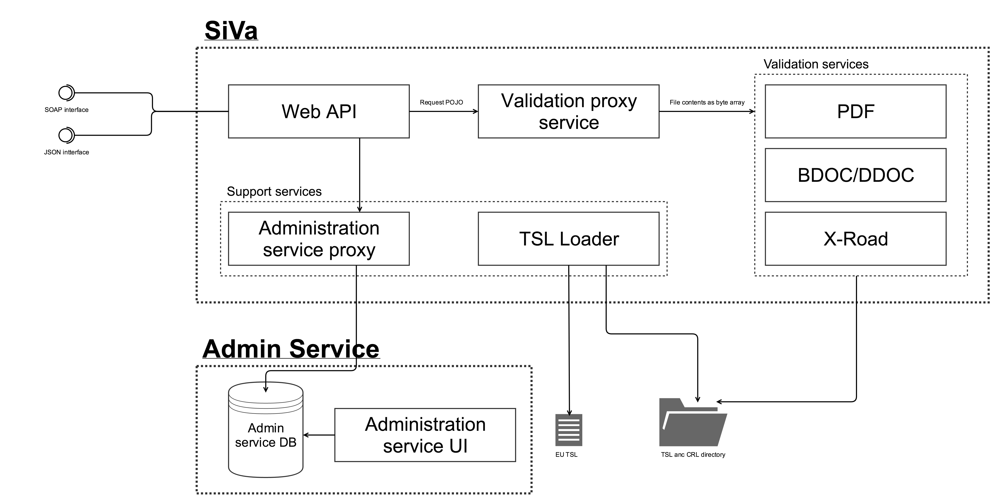

## Component diagram

### Web API

Web API is standard Spring Boot Web application module inside SiVa webapp it will take in JSON or SOAP requests sent by
systems that are integrated with SiVa web service API. The incoming requests will be converted to **SiVa Proxy Module**
Java request objects. Web API module also does basic validation of incoming requests. Checking that all the required
fields are present and document type is correct.

When validation has been completed by proxy selected validation service the returned qualified validation report Java object
will be marshalled based on incoming request to JSON or SOAP and returned to client that requested the validation.

### External configuration resources

* Optionally SiVa webapp can load in configuration file (i.e application.yml) at application startup time.
  Configuration file can control Spring Boot configuration options in addition to SiVa application
  specific options.
* Optionally SiVa webapp can also load in logging configuration options

### Validation proxy service

**Validation proxy service** or validation service selector is Spring Boot module that will take the Web API sent
request object and try to find matching validation service based on the `documentType`inside the request object.
When matching validation service have been found the proxy request is converted to validation request and sent to matched
validation service.

When no matching validation service has not been found exception is raised and error object is
returned to Web API module. On successful validation the qualified validation report Java object sent from validation
service is returned to Web API module.

!!! note
    Validation services can be added dynamically to SiVa by conforming to pattern `documentType + "ValidationService"` and new
    validation service module must be Maven dependency of `siva-validation-proxy`. Example
    would be `BDOCValidationService`.

### Validation reporting service

**Validation reporting service** is optional module that can be turned on or off using configuration file. It's Spring Boot module and
main purpose is to collect data about: incoming request, validation reports and errors that have been reported during validation process.

When HTTP authentication header have been set the reporting service will also collect its and adds to required statistics reports.

After the report object have been created the data will be sent to configured reporting service. SiVa is preconfigured to work with
Google Analytics.

### TSL Loader

TSL loader loads in contents of TSL file from given URL in online mode or from directory when
using offline mode in predefined interval.

### Validation services

All validation services use different Java library to validate given document in request. The used validation
library is described in each of the validation service section.

Common process that all validation services do with proxy forwarded validation process is:

* Convert the Base64 encoded document into `InputStream` byte array
* Check that given document is correct format (i.e valid BDOC). If not then error is thrown and
  validation process is terminated.
* After validation of signatures has been completed the validation service starts to build
  qualified validation report
* Validation report is created even validation `FAILED` or ended with `INDETERMINATE` result

### PDF Validation service

PDF or PaDES as known in DSS validation service uses [Digidoc4J DSS fork Java library](https://github.com/open-eid/sd-dss) PaDES validation
functionality using the validation policy that complies with Estonian laws and regulations.

Configurable functionality:

* Possibility to add additional validation policies using SiVa `application.yml` configuration section.

### BDOC validation service

BDOC for ASiC compliant containers both TM and TS will latest Maven released **DigiDoc4J** library

### DDOC Validation service

DDOC for previous generation digitally signed files will use latest Maven release of **JDigiDoc**

### X-Road validation service

X-Road containers are similar to ASiCE containers but are **not** valid ASiCE containers. There we could not use DSS nor DigiDoc4J provided
ASiCE validation functionality but need to X-Road developed `asicverifier` Java command line utility to validate these containers.

Source code for `asicverifier` can be found in [GitHub xroad-public repository](https://github.com/vrk-kpa/xroad-public/tree/master/src/asicverifier)*[]:
`Asicverfier` has been integrated into SiVa as Java library. Making possible to use all the Java libraries packaged into `asicverifier` fat JAR.

Configurable functionality:

* In SiVa configuration `application.yml` file You can define alternative location for `globalconf` directory to be loaded in using input stream

## Use cases

### Digitally signed document validation process

Digitally signed document validation process shows how SiVa chooses
validation service and possible output of validation process.

User of SiVa system provides digitally signed document file in form of
Base64 encoded string. The validation of file and validation policy
is handled by validation services underlying libraries.

* In case of PDF file it will be DSS
* For BDOC and DDOC files we will use DigiDoc4J or when required jDigiDoc
* And for X-Road signatures we will use X-road signature validation utility

We will log following failure cases:
When file upload fails (request started but was not completed successfully)
When request validation (JSON or SOAP) fails
When user authentication fails - **not shown in diagram above**
When signature validation fails – **not shown in diagram above**
When increasing of request count fails – **not shown in diagram above**

### Certificate loading process

All validation services require certificates to validate digitally signed
documents. Below process shows how certificates are loaded into
validation service. Loading process is done separably for each validation
service.

Certificate loading process is scheduled cron job inside each validation
service to update currently in memory loaded certificates.

This process should run after TSL loader has completed updating
SiVa local copy of certificates.

### X-Road 6 security server SOAP request process

X-Road validation process is brought out because we skip authentication
process for X-Road security server interface and and use XML SOAP
as input source.

Validation of SOAP request XML is done in the SiVa web application module.
Document validation process is described in detail in [Digitally signed document validation process](#digitally-signed-document-validation-process)
Validation report output id described in [Interface description](/siva/interface_description)

### TSL loading use case

TSL implementd in seprate module. The process is executed in two ways.

* When SiVa application is started
* As scheduled job

Loading process is required action when ASiCE (BDOC) or

