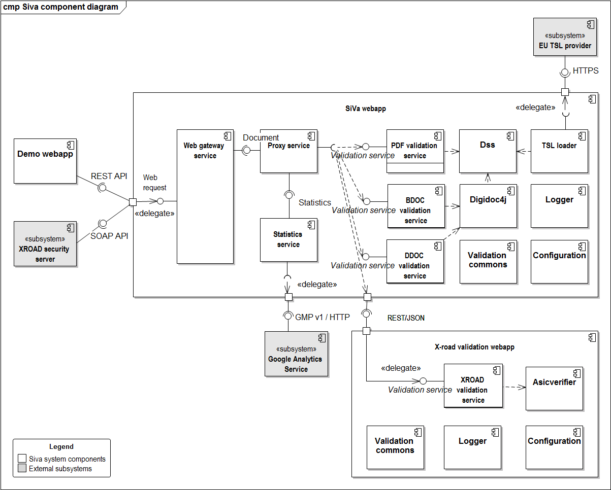

## Component diagram

### Siva webapp

All validation services use different Java library to validate given document in request. The used validation
library is described in each of the validation service section.

| Component | Description |
|------------------------------|--------------------------------------------------------|
| **Web gateway service** | Web gateway service is a single access point to the whole SiVa webapp application. Web service is implemented as a standard Spring Boot Web application module, that accepts valid JSON or SOAP requests (see the [Interfaces section](/siva/v2/interfaces.md)) sent by the client systems. Web service module is responsible for basic request and response handling. This includes basic validation of incoming requests (existence of required fields, permitted values, etc) and unmarshaling the request to a Java object before passing it to the next component – the Proxy service. Response from the proxy service is marshalled and sent back to the client according to respective API. |
| **Proxy service** | Acts as a router for the request and response. It is responsible for selecting the appropriate validation service for incoming document. - Proxy service accepts an in memory representation of a document and finds a matching validation service based on document type. The incoming request is converted to validation request and forwarded to the specific validation service. - The report returned by the specific validation service is passed to the statistics service before returning it to Web service. |
| **Statistics service** | An optional component that can be turned on or off using configuration file. It is Spring Boot module and main purpose for it is to collect data about: incoming request, validation reports and errors that have been reported during validation process. - When HTTP authentication header have been set the reporting service will also add this info to statistics report. - After the report object have been created the data will be sent to configured reporting service. SiVa is preconfigured to work with Google Analytics. - More info and specifics about the statistics service can be found in [SiVa_statistics.pdf](/pdf-files/SiVa_statistics.pdf)|
| **PDF validation service** | PDF uses **DSS** PaDES validation functionality along with the preconfigured validation policy that complies with Estonian laws and regulations. - Possibility to add additional validation policies using SiVa `application.yml` configuration section.|
| **BDOC validation service** | Provides validation services for BDOC containers. BDOC for ASiC compliant containers both TM and TS will use latest Maven released **DigiDoc4J** library |
| **DDOC validation service** | Provides validation services for DigiDoc containers. DDOC for previous generation digitally signed files will use latest Maven release of **JDigiDoc** |
| **Digidoc4j** | Digidoc4j implementation is used by BDOC and DDOC validation services. See the project Github [page](https://github.com/open-eid/digidoc4j) for further details. |
| **Dss** | Dss library implementations are used for PaDES validation and TSL loading. SiVa uses [Digidoc4J DSS fork Java library](https://github.com/open-eid/sd-dss). |
| **TSL loader** | TSL loader loads the contents of TSL file from given URL in online mode or from directory when using offline mode in predefined interval.|
| **Logger** | Logging functionality is handled by the **SLF4J** logging facade and on top of the **Logback** framework. As a result, logging can be configured via the standard Logback configuration file. By default, logging works on the `INFO` level and logs are directed to the system console. Additional logging appenders can be added (consult logback documentation for more [details](http://logback.qos.ch/documentation.html))  |
| **Configuration** | Configuration is a global component used throughout the webapp. Responsible for reading and handling the application configuration management |
| **Validation commons** | Common interfaces and utilities for all validation services (ie utilities for default and additional policies and constraints) |

### X-road validation webapp

!!! note
    X-road validation webapp is distributed as a separate webapp installation to avoid BouncyCastle libraries version conflicts and class loader issues.

| Component | Description |
|------------------------------|--------------------------------------------------------|
| **X-Road validation service** | X-Road containers are similar to ASiCE containers but are **not** valid ASiCE containers. There we could not use DSS nor DigiDoc4J provided ASiCE validation functionality but need to X-Road developed `asicverifier` Java command line utility to validate these containers.  Source code for `asicverifier` can be found in [GitHub xroad-public repository](https://github.com/vrk-kpa/xroad-public/tree/master/src/asicverifier): `Asicverfier` has been integrated into SiVa as Java library. Making possible to use all the Java libraries packaged into `asicverifier` fat JAR.  Configurable functionality: - In SiVa configuration `application.yml` file You can define alternative location for `globalconf` directory to be loaded in using input stream|
| **Asicverifier** | X-road signature validation utility (see [github project](https://github.com/vrk-kpa/xroad-public/tree/master/src/asicverifier) for details). A command line tool to validate X-Road Security server generated ASiCe files. The utility was chosen because it's only available packaged to tool to validate X-Road signature file. |
| **Logger** | Logger is a global component used throughout the webapp by every other components. Logging functionality is handled by the **SLF4J** logging facade and on top of it the **Logback** framework is used. As a result, logging can be configured via the standard Logback configuration file. By default, logging works on the `INFO` level and logs are directed to the system console. Additional logging appenders can be added (consult logback documentation for more [details](http://logback.qos.ch/documentation.html))  |
| **Configuration** | Configuration is a global component used throughout the webapp. Responsible for reading and handling the application configuration management |
| **Validation commons** | Common interfaces and utilities for all validation services (ie utilities for default and additional policies and constraints) |

### Demo webapp

| Component | Description |
|------------------------------|--------------------------------------------------------|
| **Demo webapp** | A Spring boot based web application that provides a web interface to the SiVa system for initial access and testing purposes. Contains a simple form, that can be used to send signed documents to be validated in SiVa |

### External subsystems

| Component | Description |
|------------------------------|--------------------------------------------------------|
| **XROAD security server** | A client subsystem that, once connected, allows SiVa to be integrated into the [X-Road data exchange layer](https://www.ria.ee/en/x-road.html) |
| **EU TSL provider** | A subsystem that provides SiVa with a current TSL. An HTTPS endpoint, that provides an XML formatted file that lists all trusted service providers along with their certificates. |
| **Google Analytics** | (Optional) A subsystem that can be used for business analysis based on the SiVa statistics (sent over Google Management Protocol v1). The webapp can be configured to send statistical data about validation reports to Google Analytics. See [SiVa_statistics.pdf](/pdf-files/SiVa_statistics.pdf) for further details. <ul><li>NB! Note that the exact same dataset is logged by the **Logger** component if one needs to handle generic statistical data locally (for example using Logstash and Kibana)</li></ul> |

## Use cases

### Digitally signed document validation process

Digitally signed document validation process shows how SiVa chooses
validation service and possible output of validation process.

User of SiVa system provides digitally signed document file in form of
Base64 encoded string. The validation of file and validation policy
is handled by validation services underlying libraries.

* In case of PDF file it will be DSS
* For BDOC and DDOC files we will use DigiDoc4J or when required jDigiDoc
* And for X-Road signatures we will use X-road signature validation utility

We will log following failure cases:
When file upload fails (request started but was not completed successfully)
When request validation (JSON or SOAP) fails
When user authentication fails - **not shown in diagram above**
When signature validation fails – **not shown in diagram above**
When increasing of request count fails – **not shown in diagram above**

### Certificate loading process

All validation services require certificates to validate digitally signed
documents. Below process shows how certificates are loaded into
validation service. Loading process is done separably for each validation
service.

Certificate loading process is scheduled cron job inside each validation
service to update currently in memory loaded certificates.

This process should run after TSL loader has completed updating
SiVa local copy of certificates.

### X-Road 6 security server SOAP request process

X-Road validation process is brought out because we skip authentication
process for X-Road security server interface and and use XML SOAP
as input source.

Validation of SOAP request XML is done in the SiVa web application module.
Document validation process is described in detail in [Digitally signed document validation process](#digitally-signed-document-validation-process)
Validation report output id described in [Interface description](/siva/interface_description)

### TSL loading use case

TSL implementd in seprate module. The process is executed in two ways.

* When SiVa application is started
* As scheduled job

Loading process is required action when ASiCE (BDOC) or

