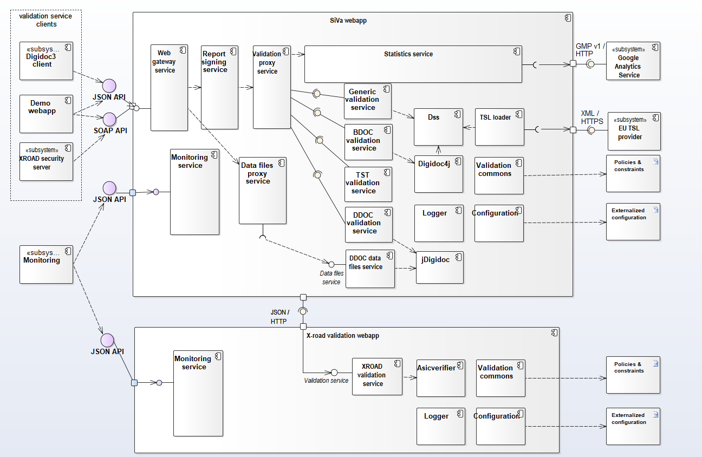

The following chapter depicts SiVa software on a component diagram.
Note that not all of the external base libraries are included in the component model to avoid duplicity with other documentation. Only relevant base libraries and dependencies are listed and described in the documentation. Information about additional and transitive dependencies of the respective validation service components can be found via the references provided.

## System components
### Siva webapp

All validation services use different Java library to validate given document in request. The used validation
library is described in each of the validation service section.

| Component | Description |
|------------------------------|--------------------------------------------------------|
| **Web gateway service** | Web gateway service is a single access point to the whole SiVa webapp application. Web service is implemented as a standard Spring Boot Web application module, that accepts valid JSON or SOAP requests (see the [Interfaces section](/siva/v2/interfaces.md)) sent by the client systems. Web service module is responsible for basic request and response handling. This includes basic validation of incoming requests (existence of required fields, permitted values, etc) and unmarshaling the request to a Java object before passing it to the next component – the Proxy service. Response from the proxy service is marshalled and sent back to the client according to respective API. |
| **Validation proxy service** | Acts as a router for the request and response. It is responsible for selecting the appropriate validation service for incoming document. - Proxy service accepts an in memory representation of a document and finds a matching validation service based on document type. The incoming request is converted to validation request and forwarded to the specific validation service. - The report returned by the specific validation service is passed to the statistics service before returning it to Web service. |
| **Data files proxy service** | Acts as a router for the request and response. It is responsible for selecting the appropriate data files extraction service for incoming document. - Proxy service accepts an in memory representation of a document and finds a matching validation service based on document type. |
| **Statistics service** | An optional component that can be turned on or off using configuration file. It is Spring Boot module and main purpose for it is to collect data about: incoming request, validation reports and errors that have been reported during validation process. - When HTTP authentication header have been set the reporting service will also add this info to statistics report. - After the report object have been created the data will be sent to configured reporting service. SiVa is preconfigured to work with Google Analytics. - More info and specifics about the statistics service can be found in [SiVa_statistics.pdf](/pdf-files/SiVa_statistics.pdf)|
| **PDF validation service** | PDF uses **DSS** PaDES validation functionality along with the preconfigured validation policy that complies with Estonian laws and regulations.|
| **BDOC validation service** | Provides validation services for BDOC containers. BDOC for ASiC compliant containers both TM and TS will use latest Maven released **DigiDoc4J** library |
| **DDOC validation service** | Provides validation services for DigiDoc containers. DDOC for previous generation digitally signed files will use latest Maven release of **JDigiDoc** |
| **DDOC data files service** | Provides files extraction services for DigiDoc containers. DDOC for previous generation digitally signed files will use latest Maven release of **JDigiDoc** |
| **Digidoc4j** | Digidoc4j implementation is used by BDOC validation service. See the project Github [page](https://github.com/open-eid/digidoc4j) for further details. |
| **Dss** | Dss library implementations are used for PaDES validation and TSL loading. SiVa uses [Digidoc4J DSS fork Java library](https://github.com/open-eid/sd-dss). |
| **JDigiDoc** | JDigiDoc implementation is used by DDOC validation service and for the DDOC data files service. See the project Github [page](https://github.com/open-eid/jdigidoc) for further details. |
| **TSL loader** | TSL loader loads the contents of TSL file from given URL in online mode or from directory when using offline mode in predefined interval.|
| **Logger** | Logging functionality is handled by the **SLF4J** logging facade and on top of the **Logback** framework. As a result, logging can be configured via the standard Logback configuration file. By default, logging works on the `INFO` level and logs are directed to the system console. Additional logging appenders can be added (consult logback documentation for more [details](http://logback.qos.ch/documentation.html))  |
| **Configuration** | Configuration is a global component used throughout the webapp. Responsible for reading and handling the application configuration management |
| **Validation commons** | Common interfaces and utilities for all validation services (ie utilities for default and additional policies and constraints) |
| **Monitoring service** | Service that provides generic information about the webapp - it's name, version, uptime and link status. (The service is disabled by default) |

### Siva webapp interfaces

Provided:

* Validation service REST interface - interface for handling validation queries.
    * JSON formatted POST requests
* Validation service SOAP interface - interface for handling validation queries
    * X-Road compliant and non-compliant SOAP requests (without the X-Road required headers)
* Data file service REST interface - interface for handling data file extraction queries.
    * JSON formatted POST requests
* Data file service SOAP interface - interface for handling data file extraction queries
    * X-Road compliant and non-compliant SOAP requests (without the X-Road required headers)
* Monitoring service REST interface - interface for retrieving the webapp's health information
    * HTTP GET that returns JSON formatted respónses

Required:

* X-road validation webapp - interface for validating X-road signed requests
* EU TSL provider interface - interface for loading the TSL
* Google Analytics service - interface for collection statistics (optional)

### X-road validation webapp

!!! note
    X-road validation webapp is distributed as a separate webapp installation to avoid BouncyCastle libraries version conflicts and class loader issues.

| Component | Description |
|------------------------------|--------------------------------------------------------|
| **X-Road validation service** | X-Road containers are similar to ASiCE containers but are **not** valid ASiCE containers. There we could not use DSS nor DigiDoc4J provided ASiCE validation functionality but need to X-Road developed `asicverifier` Java command line utility to validate these containers.  Source code for `asicverifier` can be found in [GitHub xroad-public repository](https://github.com/vrk-kpa/xroad-public/tree/master/src/asicverifier): `Asicverfier` has been integrated into SiVa as Java library. Making possible to use all the Java libraries packaged into `asicverifier` fat JAR.  Configurable functionality: - In SiVa configuration `application.yml` file You can define alternative location for `globalconf` directory to be loaded in using input stream|
| **Asicverifier** | X-road signature validation utility (see [github project](https://github.com/vrk-kpa/xroad-public/tree/master/src/asicverifier) for details). A command line tool to validate X-Road Security server generated ASiCe files. The utility was chosen because it's only available packaged to tool to validate X-Road signature file. |
| **Logger** | Logger is a global component used throughout the webapp by every other components. Logging functionality is handled by the **SLF4J** logging facade and on top of it the **Logback** framework is used. As a result, logging can be configured via the standard Logback configuration file. By default, logging works on the `INFO` level and logs are directed to the system console. Additional logging appenders can be added (consult logback documentation for more [details](http://logback.qos.ch/documentation.html))  |
| **Configuration** | Configuration is a global component used throughout the webapp. Responsible for reading and handling the application configuration management |
| **Validation commons** | Common interfaces and utilities for all validation services (ie utilities for default and additional policies and constraints) |
| **Monitoring service** | Service that provides generic information about the webapp - it's name, version, uptime and link status. (The service is disabled by default) |

### X-road validation webapp interfaces

Provided:

* Validation service REST interface - interface for handling X-Road signed requests.
    * JSON formatted POST queries
* Monitoring service REST interface - interface for retrieving the webapp's health information
    * HTTP GET that returns JSON formatted respónses

Required:

* N/A

### Demo webapp

| Component | Description |
|------------------------------|--------------------------------------------------------|
| **Demo webapp** | A Spring boot based web application that provides a web interface to the SiVa system for initial access and testing purposes. Offers a simple and user friendly presentation layer for the whole SiVa webapp. Contains a simple form, that can be used to send signed documents to be validated in SiVa. |

### Demo webapp interfaces

Provided:

* Web interface - interface for handling X-Road signed requests.
    * JSON formatted POST queries

Required:

* Siva webapp REST interface
* Siva webapp SOAP interface

### External configuration

| Component | Description |
|------------------------------|--------------------------------------------------------|
| **Policies and constraints** | (Optional) By default, two policies are supported and integrated into SiVa - see [SiVa Validation Policy](/siva/appendix/validation_policy). However, it is possible to customize the validation policies and their constraints. Configuration is validation service specific. See the [overriding configuration](/siva/v2/systemintegrators_guide/#configuration-parameters) section for details. |
| **Externalized configuration** | Application specific configuration (property files, command line variables, etc) that allow overriding the default values set within the webapp. |

## External subsystems

| Component | Description |
|------------------------------|--------------------------------------------------------|
| **Digidoc3 client** | DigiDoc3 client is a program that can be used to sign digitally with ID-card and Mobile-ID, check the validity of digital signatures and open and save documents inside the signature container. See the github [project](https://github.com/open-eid/qdigidoc) for further details. |
| **XROAD security server** | A client subsystem that, once connected, allows SiVa to be integrated into the [X-Road data exchange layer](https://www.ria.ee/en/x-road.html) |
| **EU TSL provider** | A subsystem that provides SiVa with a current TSL. An HTTPS endpoint, that provides an XML formatted file that lists all trusted service providers along with their certificates. |
| **Google Analytics** | (Optional) A subsystem that can be used for business analysis based on the SiVa statistics (sent over Google Management Protocol v1). The webapp can be configured to send statistical data about validation reports to Google Analytics. See [SiVa_statistics.pdf](/pdf-files/SiVa_statistics.pdf) for further details. <ul><li>NB! Note that the exact same dataset is logged by the **Logger** component if one needs to handle generic statistical data locally (for example using Logstash and Kibana)</li></ul> |
| **Monitoring** | (Optional) A subsystem that tracks the health and uptime of SiVa webapps</li></ul> |

