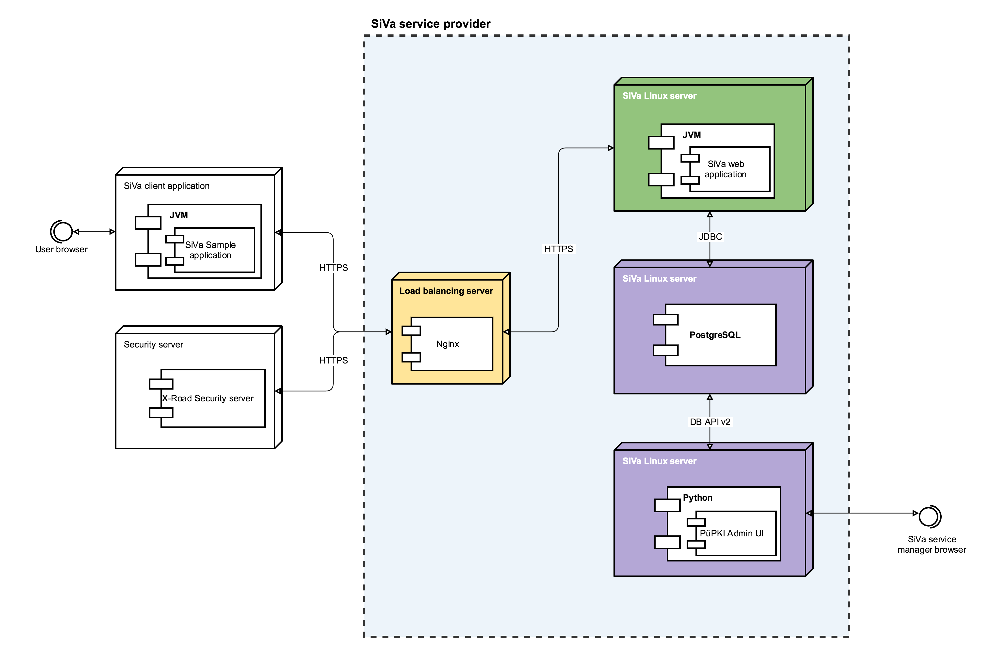

The deployment view of the architecture describes the various physical nodes in the most typical configuration for SiVa service provider.

### Nodes

In the following section, a description of each network node element is described in detail.

| Node | Setup description |
| ------ | ----------- |
| **Load balancer server** | Load balancer distributes traffic between SiVa server nodes when there is more than one Siva server instance running. SiVa does not set any specific requirements for load balancer. As an example, the nginx reverse proxy is used.|
| **Siva server** | The **SiVa webapp** service is set up to run on SiVa server. SiVa web appliction is executable Spring Boot JAR file. This means all the dependencies and servlet containers are packaged inside single JAR file. The JAR file can be placed anywhere in server and the JAR must be marked executable if its not already.  There also should be separate user created to run executalbe JAR as Linux service.  Read more about running [Spring Boot applications as Linux system service](https://docs.spring.io/spring-boot/docs/current/reference/html/deployment-install.html#deployment-service) <ul><li>X-road validation webapp</li></ul> SiVa X-Road validation service is also Spring Boot executable JAR application and also should be installed as Linux service. X-Road validation service communicates with SiVa web application over HTTP and default port is 8081  Note that X-Road separate installation is required to avoid BouncyCastle library version conflicts and class loader issues.|
| **X-road security server** | A standard X-road security server setup. The SiVa validation service wsdl has to be registered to provide service to other organisations using XRoad infrastructure. Setting up XRoad Security server is out of scope for SiVa documentaton (see the [official installation instructions](https://www.x-tee.ee/docs/live/xroad/ig-ss_x-road_v6_security_server_installation_guide.html)).|
| **Demo server** | Demo server hosts the **Demo webapp** provided within SiVa project as a reference client implementation. <ul><li>Demo webapp - single Java web application that provides a simple form to upload and validate a signed file in Siva webapp. Demo webapp serves as a tool for evaluating and testing the validation service. </li></ul>|

### Horizontal scaling

Neither the **Siva webapp**, nor **Demo wbapp** persist their state in sessions between requests. Therefore it is possible to install multiple instances of these services behind respective load balancers.

