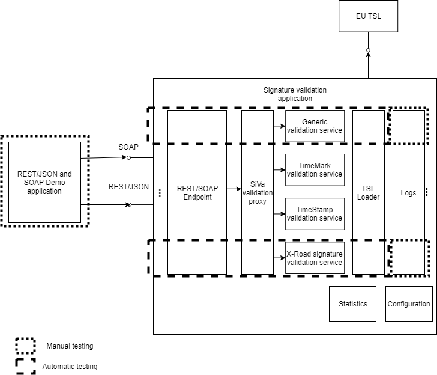
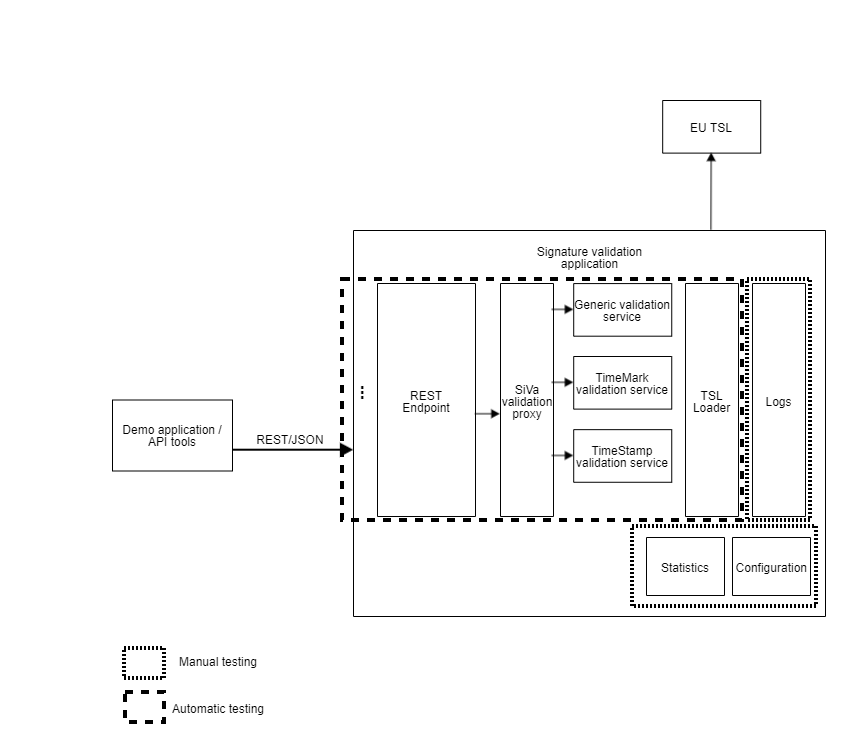

<!--# QA Strategy-->
## Introduction
The goal of this document is to give general overview of the used infrastructure, processes, schedule and actions to ensure good quality delivery. The document describes activities in the whole software development process. Analysis, development and testing are separated for the sake of structure and transparency although they are integral parts of the development cycle.
This is living document and will be constantly updated as the project evolves.
## Environments and infrastructure

There are different test environments for quality assurance, depending on the nature and aim.

1. GitHub Actions environment for public CI - Platform: Linux
2. Test environment for local test and load test - Platform: Linux

Instructions how to set up test environment and run tests together with more info can be found in [SiVa GitHub page](https://github.com/open-eid/SiVa).

System requirements:

* At least 4GB of RAM on machine where the build is executed
* Minimum required Java version is Java 11
* SiVa project provided Maven Wrapper (./mvnw)

Tools used:

* GitHub Actions – is a continuous integration service used to build and test software projects hosted at GitHub
* IntelliJ IDEA – is a Java integrated development environment(IDE) for developing and executing automated tests locally
* Apache Tomcat - is an open source servlet container developed by the Apache Software Foundation.
* Rest-Assured - is a Java DSL(Domain-specific language) for simplifying testing of REST based Services built on top of HTTP Builder.
* Docker - is an open platform for developing, shipping, and running applications.

## Analysis
Analysis will be tagged with identificators to enable cross-reference between requirements and corresponding tests. This includes both functional and non-functional requirements.

## Development
### Development process
Customized process based on Kanban is used in the development. The process consists of following elements:

* Product backlog is maintained in JIRA
* Tasks are maintained through JIRA Kanban board
* Daily team stand-ups are held
* Tasks marked done are developed, tested and ready to be shipped
* Weekly meetings are held to give status on progress and discuss open questions


### Issue lifecycle
Each ticket in JIRA Kanban board goes through the following states that correspond the development procedure described in previous chapter.


Description of states:

* Awaiting analysis - ticket to be dealt with, product backlog.
* Awaiting implementation - ticket analysed and ready to be implemented.
* In progress - ticket is being handled (feature coding, document writing, ...).
* In Review - ticket is ready for review
* Resolved - ticket is ready for test
* Closed - ticket has been tested and found ready for release

### QA activities and quality criterias in the development
**Process improvement**

The development process is constantly monitored and adjusted to the changing situations. Retrospective meetings for process feedback are held.

**Unit tests**

It is responsibility of developer to write, maintain and execute the unit tests on developed features. The code must compile and pass unit tests before it is allowed to be submitted to the code repository. The code of the unit tests is integral part of the source code and is maintained on the same principles.
Unit tests are also automatically executed on each build, if the unit tests do not pass further test execution is stopped.

**Static testing/code reviews**

All changes (including changes in unit test code) are reviewed by another development team member using GitHub. The code must pass review before it is submitted to testing.
SonarLint is used to validate code automatically.

## Testing
### Approach
The goal is to automate as much of the testing process as possible, however some aspects of the testing will be carried out manually.
As the development is carried out by the backlog priority the testing follows the same principle. After each feature release test cases, test automation code and test results will be available through GitHub.


### Testing process
Automatic integration and system tests are ran against deployed SiVa instance (deployed either locally or through CI).

### Test case management
Test cases are handled as integral part of test automation code. The same applies on manual tests, in manual test cases some portion of automation may be used to execute the tests but the results are verified manually. All the test cases and test code will be maintained in the GitHub.
Test cases are developed and maintained together with test automation code by the QA specialist for Integration and System Testing.
Following elements will be present in test cases:

* TestCaseID: unique ID that makes possible to identify specific test case
* TestType: Automated, Automated SoapUI or Manual
* Requirement: Reference to the requirement that is tested
* Title: Description of the test
* Expected Result: expected outcome of the test (pass criteria for the test)
* File: input test file that is used


**Test case sample**

Automatic and manual test cases will have the same description principles (shown below).

```bash
/**
* TestCaseID: Bdoc-ValidationFail-27
*
* TestType: Automated
*
* Requirement: http://open-eid.github.io/SiVa/siva/appendix/validation_policy/#common-validation-constraints-polv1-polv2
*
* Title: Bdoc OCSP response doesn't correspond to the signers certificate
*
* Expected Result: The document should fail the validation
*
* File: NS28_WrongSignerCertInOCSPResp.bdoc
*/
@Test
public void bdocWrongSignersCertInOcspResponse() {
setTestFilesDirectory("bdoc/live/timemark/");
post(validationRequestFor("NS28_WrongSignerCertInOCSPResp.bdoc"))
.then()
.body("signatures[0].indication", Matchers.is("TOTAL-FAILED"))
.body("signatures[0].subIndication", Matchers.is("TRY_LATER"))
.body("signatures[0].errors.content", Matchers.hasItem("No revocation data for the certificate"))
.body("validSignaturesCount", Matchers.is(0));
}
```
### Defect management
All found defects will be reported and handled in Jira. The defect report will follow similar lifecycle in JIRA Kanban board as tasks.
The report will have at least the following elements:

* Title: Short, precise description of the problem
* Details: Type, Priority, Epic Link
* Description:
	* **Steps to reproduce bug** - sequence for reproduction, link to test case if applicable.
	* **Expected behavior** - expected outcome of the test sequence.
	* **Actual behavior** - actual result of the test sequence. The description should be thorough enough to enable the debugging of the problem and to give objective base for severity assessment.
	* **File attachments** - Test files, logs, images, ...

### Test levels
**Integration testing**

The scope of the tests is illustrated on the image below. The goal is to test the SiVA application API (both X-Road and REST/JSON) and to test the independent module capability for validation of specific type of file. Both valid and invalid inputs are tested. More info about testing specifics can be found in Test Plan [Integration testing](/siva3/test_plan/#integration-test-introduction/) section.


**System testing**

The scope of the tests is illustrated on the image below. The goal of the test is to test the entire length of signature validation process and to test supportive functions. In addition Demo application is tested. More info about testing specifics can be found in Test Plan [System testing](/siva3/test_plan/#system-test-introduction/) section.


**Regression testing**

Regression testing will consist of two parts:
Running all automated tests (unit, integration and system tests)
Manual testing of the areas that are not covered by automatic tests based on the regression test checklist

**Performance testing**

The scope of the load testing is to determine the throughput capabilities of a single SiVa node and how it handles requests under increasing load.
Gatling is used for load testing and the tests can be found in [SiVa-perftests GitHub page](https://github.com/open-eid/SiVa-perftests/tree/master).
